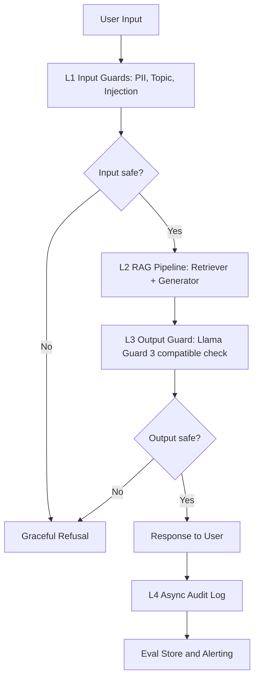

# Lab 24 Production Blueprint

## Section 1: SLO Definition

| Metric | Target | Alert Threshold | Severity |
|---|---:|---:|---|
| Faithfulness | >= 0.85 | < 0.80 for 30 min | P2 |
| Answer Relevancy | >= 0.80 | < 0.75 for 30 min | P2 |
| Context Precision | >= 0.70 | < 0.65 for 1 hour | P3 |
| Context Recall | >= 0.75 | < 0.70 for 1 hour | P3 |
| P95 Latency with guardrails | < 2500 ms | > 3000 ms for 5 min | P1 |
| Guardrail Detection Rate | >= 90% | < 85% for latest test batch | P2 |
| False Positive Rate | < 5% | > 10% for latest test batch | P2 |

## Section 2: Architecture Diagram

Latency targets: L1 P95 < 50 ms, L2 P95 depends on generation model, L3 P95 < 100 ms, audit logging is async and excluded from user-facing latency.

## Section 3: Alert Playbook

### Incident: Faithfulness drops below 0.80

**Severity:** P2

**Detection:** Continuous evaluation gate or scheduled RAGAS run.

**Likely causes:** Retriever returns weak evidence, corpus was updated without re-indexing, or generation prompt changed.

**Investigation steps:** Compare context precision at the same timestamp, inspect prompt and retriever version diffs, sample bottom 10 failures, and check corpus update logs.

**Resolution:** Re-index corpus, rollback prompt if needed, raise top_k, and add reranking for affected document classes.

### Incident: P95 latency exceeds 3000 ms

**Severity:** P1

**Detection:** Latency monitor on guarded pipeline.

**Likely causes:** Llama Guard API latency, sequential guardrail calls, model provider slowdown, or synchronous audit logging.

**Investigation steps:** Break down L1/L2/L3 timings, compare provider status, check retry rate, and verify audit logging is fire-and-forget.

**Resolution:** Run guards in parallel, enable provider fallback, cache repeated safety decisions, and move audit writes to a queue.

### Incident: Guardrail detection rate below 85%

**Severity:** P2

**Detection:** Nightly adversarial regression suite.

**Likely causes:** New jailbreak pattern, topic validator too permissive, or unsafe output test coverage gap.

**Investigation steps:** Group misses by attack type, inspect false negatives, check recent prompt changes, and run a fresh jailbreak sample.

**Resolution:** Add signatures for common attacks, route suspicious requests to stricter classifier, and expand the adversarial suite.

### Incident: False positive rate above 10%

**Severity:** P2

**Detection:** User feedback and legit-query test batch.

**Likely causes:** Overbroad topic keywords, PII regex matching normal numbers, or output guard misclassifying safety discussion.

**Investigation steps:** Review blocked legitimate requests, separate input and output guard causes, and compute false positives by language.

**Resolution:** Add allowlist patterns for educational safety discussion, tune regex boundaries, and return clarification instead of refusal for ambiguous input.

## Section 4: Cost Analysis

Assumption: 100,000 user queries per month.

| Component | Unit Cost | Volume | Monthly Cost |
|---|---:|---:|---:|
| RAG generation, GPT-4o-mini class | $0.001 / query | 100k | $100 |
| RAGAS continuous eval, 1% sample | $0.01 / query | 1k | $10 |
| LLM judge tier 2 | $0.001 / query | 10k | $10 |
| LLM judge tier 3 | $0.05 / query | 1k | $50 |
| Presidio and regex PII | self-hosted | 100k | $0 |
| Llama Guard 3 self-hosted GPU | $0.30 / hour | 720 hr | $216 |
| **Total** |  |  | **$386** |

Cost optimization opportunities:

- Run full RAGAS on sampled traffic and cheap lexical checks on all traffic.
- Use tiered judge routing: only uncertain cases go to expensive models.
- Use API-based Llama Guard for low volume and self-host when utilization is stable.
- Cache repeated judge and guardrail decisions by normalized query hash.

