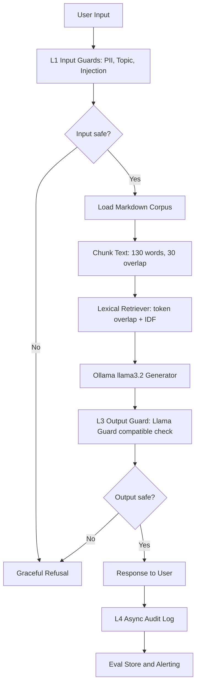

# Lab 24 Production Blueprint

This blueprint describes the current implemented stack in this repository: a local markdown RAG pipeline in `scripts/rag_pipeline.py`, lexical chunk retrieval over `docs/` and `lab24-student-edition.md`, answer generation through local Ollama `llama3.2:latest`, input/output guardrails, artifact generation, and CI evaluation gating.

## Current Evaluation Snapshot

Latest Phase A run over 50 questions:

| Metric | Current Score | Target | Status |
|---|---:|---:|---|
| Faithfulness | 0.772 | >= 0.85 | Below target, above CI gate |
| Answer Relevancy | 0.900 | >= 0.80 | Pass |
| Context Precision | 0.725 | >= 0.70 | Pass |
| Context Recall | 0.863 | >= 0.75 | Pass |

Model and cost:

- RAG generator: Ollama `llama3.2:latest`
- Retrieval: local lexical scoring over markdown chunks
- Questions evaluated: 50
- Direct API cost: $0.00

## Section 1: SLO Definition

| Metric | Target | Alert Threshold | Severity |
|---|---:|---:|---|
| Faithfulness | >= 0.85 | < 0.80 for 30 min | P2 |
| Answer Relevancy | >= 0.80 | < 0.75 for 30 min | P2 |
| Context Precision | >= 0.70 | < 0.65 for 1 hour | P3 |
| Context Recall | >= 0.75 | < 0.70 for 1 hour | P3 |
| P95 Latency with guardrails | < 5000 ms on local Ollama | > 6000 ms for 5 min | P1 |
| Guardrail Detection Rate | >= 90% | < 85% for latest test batch | P2 |
| False Positive Rate | < 5% | > 10% for latest test batch | P2 |

## Section 2: Architecture Diagram

Implemented components:

- Corpus loader: `docs/*.md`, `docs/*.txt`, and `lab24-student-edition.md`
- Retriever: stdlib lexical retrieval, no external vector database
- Generator: local Ollama endpoint `http://127.0.0.1:11434/api/generate`
- Guarded pipeline: `phase-c/full_pipeline.py`
- Evaluation artifact generation: `scripts/generate_lab24_artifacts.py --model llama3.2:latest`

Latency targets: L1 P95 < 50 ms, L2 P95 < 5000 ms on local Ollama, L3 P95 < 100 ms, audit logging is async and excluded from user-facing latency. Latest short live benchmark showed L1 P95 0.2 ms, L2 P95 4505.2 ms, L3 P95 42.0 ms.

## Section 3: Alert Playbook

### Incident: Faithfulness drops below 0.80

**Severity:** P2

**Detection:** Continuous evaluation gate or scheduled RAGAS run.

**Likely causes:** Lexical retriever returns weak evidence, corpus was updated without rebuilding chunks, chunking is too broad, or the Ollama generation prompt changed.

**Investigation steps:** Compare context precision at the same timestamp, inspect prompt and retriever version diffs, sample bottom 10 failures in `phase-a/failure_analysis.md`, and check corpus update logs.

**Resolution:** Rebuild the local index, rollback prompt if needed, raise `top_k`, tune chunk size/overlap, or add BM25/vector embeddings for affected document classes.

### Incident: P95 latency exceeds 3000 ms

**Severity:** P1

**Detection:** Latency monitor on guarded pipeline.

**Likely causes:** Ollama `llama3.2` generation latency, cold model load, large retrieved context, sequential guardrail calls, or synchronous audit logging.

**Investigation steps:** Break down L1/L2/L3 timings, check whether Ollama model is already loaded, inspect prompt/context length, and verify audit logging is fire-and-forget.

**Resolution:** Keep Ollama warm, reduce `top_k` or chunk size, run guards in parallel, cache repeated safety decisions, and move audit writes to a queue.

### Incident: Guardrail detection rate below 85%

**Severity:** P2

**Detection:** Nightly adversarial regression suite.

**Likely causes:** New jailbreak pattern, topic validator too permissive, or unsafe output test coverage gap.

**Investigation steps:** Group misses by attack type, inspect false negatives, check recent prompt changes, and run a fresh jailbreak sample.

**Resolution:** Add signatures for common attacks, route suspicious requests to stricter classifier, and expand the adversarial suite.

### Incident: False positive rate above 10%

**Severity:** P2

**Detection:** User feedback and legit-query test batch.

**Likely causes:** Overbroad topic keywords, PII regex matching normal numbers, or output guard misclassifying safety discussion.

**Investigation steps:** Review blocked legitimate requests, separate input and output guard causes, and compute false positives by language.

**Resolution:** Add allowlist patterns for educational safety discussion, tune regex boundaries, and return clarification instead of refusal for ambiguous input.

## Section 4: Cost Analysis

Assumption: 100,000 user queries per month.

| Component | Unit Cost | Volume | Monthly Cost |
|---|---:|---:|---:|
| RAG generation, Ollama llama3.2 local | hardware/electricity only | 100k | $0 direct API |
| Retrieval, local lexical index | included | 100k | $0 |
| RAGAS-style local eval, 1% sample | local CPU/Ollama | 1k | $0 direct API |
| LLM judge, current deterministic/local artifact | local | 10k | $0 direct API |
| Regex PII and topic guard | local | 100k | $0 |
| Output guard, local compatibility check | local | 100k | $0 |
| Optional hosted judge fallback | $0.001 / query | 10k | $10 |
| Optional hosted Llama Guard fallback | provider dependent | 100k | TBD |
| **Total direct API cost** |  |  | **$0 current / $10+ with hosted fallback** |

Cost optimization opportunities:

- Keep local Ollama warm to avoid cold-start latency.
- Run full local evaluation on sampled traffic and cheaper lexical checks on all traffic.
- Use tiered judge routing only when local judge confidence is low.
- Use API-based Llama Guard only as fallback when local checks are uncertain.
- Cache repeated judge and guardrail decisions by normalized query hash.
